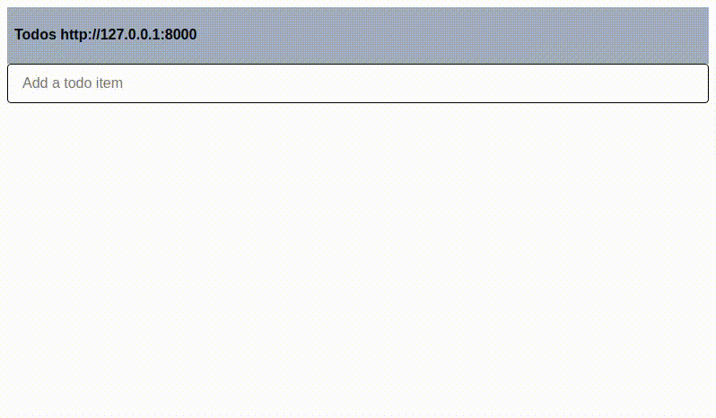

# DevOps Application Test

This test covers your general Kubernetes knowledge. You're supposed to deploy an application of three Docker containers to a minikube[^1] and document your work using git[^2].
Suppose, the app comes from a developer who ran that app via `docker-compose` locally.

If you need help, feel free to open a ticket at our helpdesk[^6] or write an email[^5].

## General

We expect you to solve the problem on your own machine using the following software:

* Docker[^3] >= v20.10.11
* docker-compose >= v1.29.2
* Helm[^4] >= v3.7.1
* minikube[^1] >=v1.24.0

The app containers are:
* https://hub.docker.com/r/tuergeist/minikube-frontend
* https://hub.docker.com/r/tuergeist/minikube-backend

## Task

* You're supposed to set up a kubernetes cluster with helm charts
* Make sure your solution supports and you documented how to
  * create the cluster 
  * run the app
  * backup the app (database dumps)
  * restore the app from backup
  * clean up everything (on the minikube)

* The app consists of three Docker containers and shall use nginx as ingress controller
* We provided a [[docker-compose.yaml]] for you to see, how our developers deployed the app locally
* We also provided a [[Makefile]] as an idea and helper to start the cluster and run special commands with it. There is no need to use it.
* Test your solution

## Clarification

If you run the app (e.g. via `docker-compose up` locally at http://127.0.0.1:3000/ ), it shall look like in the following video

If not solved differently, we'll use the Makefile to test your solution. But you can provide a different solution as long as you use helm.

* Use `make init` to create a minikube cluster.
* Create your Helm chart.
  * The cluster uses the nginx ingress controller.
* Test your Helm chart against the cluster.
* Use `make backup` and `make restore` for creating and restoring database dumps.
* If everything is done, cleanup the environment with `make cleanup`.

# Resources

[^1]: https://minikube.sigs.k8s.io/docs/start/
[^2]: https://git-scm.com
[^3]: https://www.docker.com/
[^4]: https://helm.sh/
[^5]: mailto:support@fyltura.de
[^6]: https://expertsieve.freshdesk.com/
